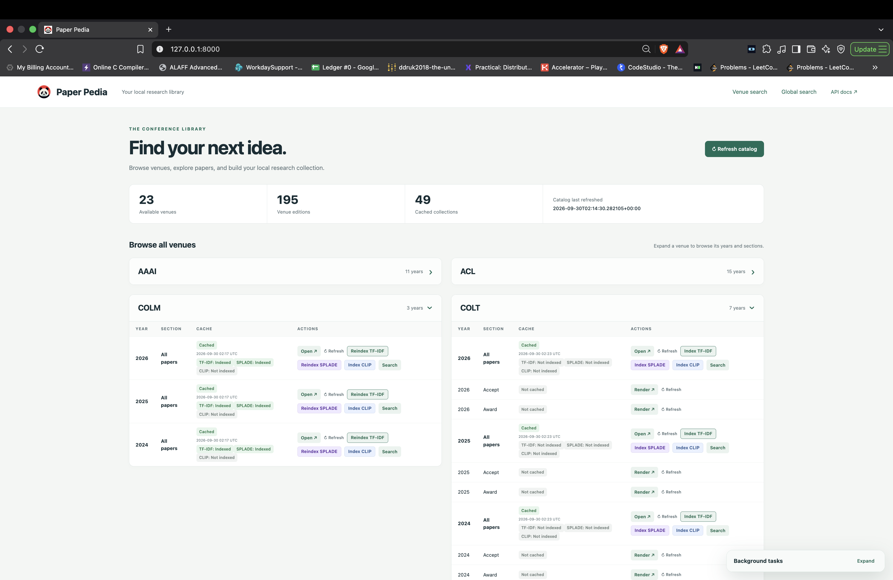
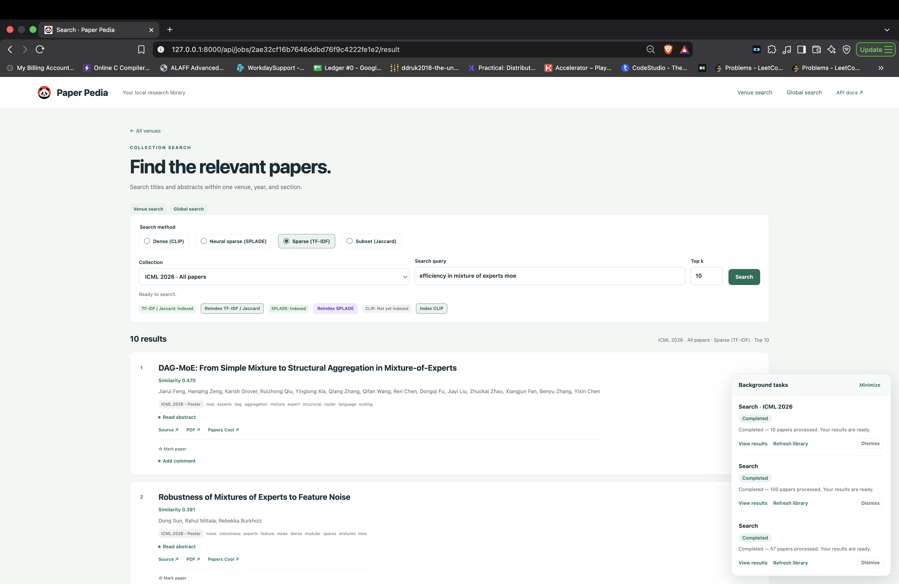
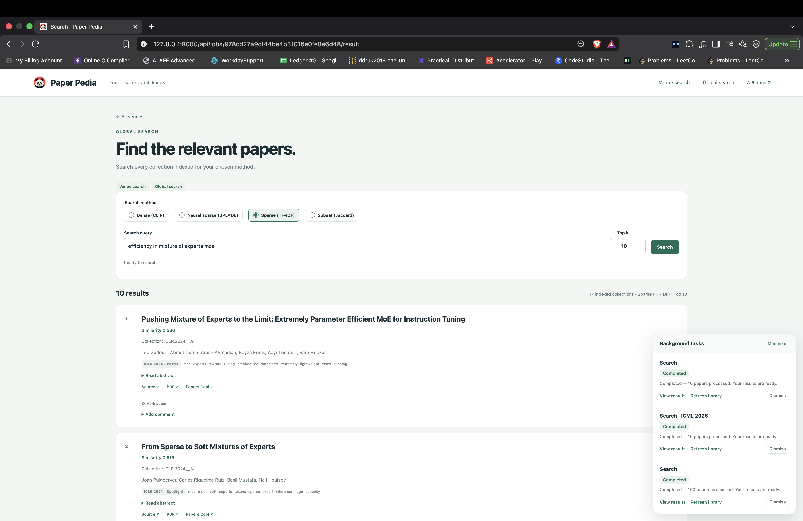

<p align="center">
  
</p>
<h1 align="center">Paper Pedia</h1>
<p align="center"><strong>Turn conference proceedings into a searchable research library.</strong></p>
<p align="center">Browse a venue. Save a collection. Find the papers worth reading next.</p>
<p align="center">
  
  
  
  <a href="LICENSE"></a>
</p>
<p align="center">
  <a href="#why-paper-pedia">Why Paper Pedia?</a> ·
  <a href="#see-it-in-action">Screenshots</a> ·
  <a href="#quick-start">Quick start</a> ·
  <a href="#run-with-docker">Docker</a> ·
  <a href="#four-ways-to-find-a-paper">Search methods</a> ·
  <a href="#your-data-your-files">Your data</a>
</p>

## Why Paper Pedia?

A conference publishes thousands of papers. You have a research question, a few keywords, and limited time to work through them.

Paper Pedia helps you turn that long list into a focused reading shortlist. Pick a **venue, year, and section**—for example, CVPR 2026 Oral—save its paper metadata locally, and search using the method that fits your question. Stay within one collection or search across every indexed collection in your library, then mark useful papers and save your reading notes.

It is useful when you want to:

- **Start a literature review.** Search a specific conference edition instead of sorting through unrelated years and venues.
- **Catch up on a research area.** Explore collections from ICLR, CVPR, NeurIPS, ACL, and other venues discovered through Papers Cool.
- **Find familiar terminology or explore a topic.** Compare CLIP embeddings, SPLADE learned sparse terms, TF-IDF keywords, and Jaccard word overlap.
- **Search across conference editions.** Global search combines matches from all collections indexed for your chosen method and removes duplicate paper IDs.
- **Build a reading shortlist.** Mark papers and attach comments that follow each paper across collections.
- **Pick up where you left off.** Previous queries appear as suggestions as you type, saved in your browser.
- **Return to the same collection without fetching it again.** Reuse local paper caches and search indexes across server restarts.
- **Take the results into your own workflow.** Download CSVs for notebooks, analysis, reading lists, or another application.

Search runs on your machine. Once a collection and its required index/model are cached, searching that collection does not require a hosted inference service or an API key.

## See it in action

### Your conference dashboard

Expand a venue to browse its years and sections. Cache badges and independent TF-IDF, SPLADE, and CLIP controls show what is ready to open, index, or refresh.



### Search one venue collection

Choose a venue, year, and section; switch between four search methods; and return your top k matches. Result cards include abstracts, source links, marks, and comments. The background panel keeps progress visible while you browse.



### Search your whole indexed library

Global search brings together results across indexed collections, with a source collection on each result. Use it to follow a research question across venues and years.



## A small workflow with a useful payoff

**Browse → Render → Index → Search → Read**

1. **Expand a venue.** The home page lists available years and sections in collapsed venue cards.
2. **Render a collection.** Paper Pedia loads its existing CSV or fetches the paper metadata and saves it locally.
3. **Choose an index.** Build **TF-IDF** for Sparse and Subset search, **SPLADE** for neural sparse search, or **CLIP** for dense search.
4. **Ask your question.** Choose **Venue search** or **Global search**, select a method, enter a query, and choose how many results to return.
5. **Explore the shortlist.** Read titles, authors, and abstracts; follow paper or PDF links; mark promising papers and save comments.

For example, select **CVPR → 2026 → Oral**, build an index, and try:

> reconstructing a 3D scene from a single image

Choose **Dense (CLIP)** for embedding similarity, **Neural sparse (SPLADE)** for learned term relevance, **Sparse (TF-IDF)** for distinctive terms, or **Subset (Jaccard)** for word-set overlap. Venue search stays within your selected collection; Global search searches all collections with a fresh index for that method.

## Four ways to find a paper

### 🧠 Neural sparse · SPLADE

Encodes titles, abstracts, and queries with [`naver/splade-cocondenser-ensembledistil`](https://huggingface.co/naver/splade-cocondenser-ensembledistil). The model learns weighted vocabulary terms, including related terms absent from the original text. Papers are ranked by the **dot product of their sparse weights and the query's sparse weights**.

- Stores only nonzero **term ID → weight** entries as indexed SQLite postings, alongside paper metadata. No dense embedding arrays are stored or loaded for retrieval.
- Joins query terms directly to matching postings and returns the top k positive scores. No Qdrant service or separate database setup is needed.
- Uses the canonical masked `max(log(1 + ReLU(logits)))` pooling. Long texts are chunked at the model's 512-token context limit; elementwise maximum merges their term weights.
- Uses **MPS on supported Macs**, otherwise CUDA when available, then CPU; acceleration failures retry on CPU.
- Keeps language context for the model after HTML, Unicode, and whitespace cleanup. TF-IDF's stemming and stop-word removal are not applied to SPLADE.
- Caches the pinned model revision locally after its initial download, with independent **Index SPLADE / Reindex SPLADE** controls.

Try it when your research question uses different wording from a paper's title or abstract. Retrieval quality still depends on the collection and query. SPLADE scores are unnormalized dot products and can exceed 1.

**CLIP and SPLADE coexist.** Each has independent indexes and model caches. Existing compatible CLIP indexes are reused; a changed CSV requires reindexing only the methods you want to search.

### 🖼️ Dense · CLIP

Uses the text encoder from `openai/clip-vit-base-patch32` to embed titles and abstracts. Long text is chunked, combined using token-count weighting, and normalized. Retrieval uses cosine similarity against dense float32 vectors in `src/data/clip_indices/<collection>.clip.sqlite3`.

Choose **Dense (CLIP)** in the search radios, and use **Index CLIP / Reindex CLIP**. Both indexing and searching use the background queue. MPS is preferred on supported Macs, followed by CUDA and CPU; model files are cached in `src/data/models/clip`. CLIP search stays disabled until this collection has a fresh CLIP index, independently of SPLADE and TF-IDF.

For API clients, build `/api/venues/clip-index` and search with `mode=dense`; SPLADE continues to use `/api/venues/splade-index` and `mode=splade`. Optional settings: `PAPER_PEDIA_CLIP_DEVICE=auto|mps|cuda|cpu` and `PAPER_PEDIA_CLIP_BATCH_SIZE=32`. CLIP ranks by image–text-trained representations, so compare its results with SPLADE for specialized scientific queries.

### 🔎 Sparse · TF-IDF

Ranks papers by distinctive terms shared with your query, using normalized TF-IDF vectors and cosine similarity.

- Searches **title + abstract**.
- Cleans HTML, normalizes Unicode and case, removes English stop words, and applies English stemming.
- Stores sparse term postings in SQLite.
- Requires no model download.

Try it for named methods, technical vocabulary, or a handful of precise keywords.

### 🧩 Subset · Jaccard

Compares the unique normalized words in the query and each paper:

```text
Jaccard similarity = shared words / all distinct words in either text
```

It reuses the TF-IDF index's normalized token sets. Repeating a word does not increase the score, and query words absent from the collection still count toward the union.

Try it when you want an overlap-based comparison. “Subset” is the UI label; scoring uses Jaccard similarity, not a strict subset test.

> Choose **Top k** from 1 to 100. Scores are similarity measures, not probabilities, and should not be compared directly across methods. SPLADE, TF-IDF, and Jaccard return fewer than k results when fewer papers have a positive match.

## Quick start

Requires **Python 3.12+**. The recommended setup uses [uv](https://docs.astral.sh/uv/).

```bash
git clone https://github.com/DEBASMITROY2002/paper-pedia.git
cd paper-pedia
uv sync
uv run uvicorn wsgi:app --app-dir src --reload
```

Open **[http://127.0.0.1:8000](http://127.0.0.1:8000)**.

On a fresh installation, the app fetches the venue catalog when needed. Rendering uncached papers needs internet access. The first CLIP or SPLADE operation also downloads the corresponding model weights; subsequent operations reuse the local model cache.

<details>
<summary><strong>Prefer pip?</strong></summary>

```bash
python3 -m venv .venv
source .venv/bin/activate
python -m pip install -e .
python -m uvicorn wsgi:app --app-dir src --reload
```

On Windows, activate the environment with `.venv\Scripts\activate` instead.

</details>

## Run with Docker

```bash
mkdir -p src/data
docker compose build
docker compose up -d --wait
```

Open **[http://127.0.0.1:8000](http://127.0.0.1:8000)**. To use a different host port, run `PAPER_PEDIA_PORT=8080 docker compose up -d`.

Compose bind-mounts the existing **`./src/data`** directory to **`/app/data`**. CSVs, catalog, indexes, model downloads, and logs persist on your host; they are not copied into the image. Keep this directory present before starting. The image uses a cached dependency build stage, a slim Python runtime, a non-root application user, CPU-only Linux PyTorch wheels, and a health check. Local source edits require rebuilding the image.

Docker Desktop runs Linux containers, so this setup uses **CPU inference**. Native macOS execution still uses MPS when available. Existing CLIP and SPLADE index files and model caches remain compatible. Linux hosts may need to grant UID 1000 write access to the mounted data directory. Use one app worker for the in-memory background queue, and avoid simultaneous refresh/index writes from both a native server and the container against the same collection.

```bash
docker compose logs -f app       # Follow backend logs
docker compose ps               # Check health and port mapping
docker compose down             # Stop; host data is retained
```

The container gets ten minutes to finish jobs during a graceful stop. If forced to stop before a job completes, retry that job after restart; completed caches and CSV checkpoints stay on the host.

## Built for collections you come back to

- **Visible cache and index status.** See which collections are ready to open or search.
- **Separate refresh controls.** Refresh the venue catalog, a collection's papers, or each search index independently.
- **Search readiness checks.** Search is disabled with **“Not yet indexed”** when the chosen collection and method lack an index. A changed CSV requires reindexing.
- **Progress checkpoints.** Every 500 unique papers, the scraper saves a cumulative `.partial.csv` checkpoint.
- **Safe replacements.** Failed downloads and failed index builds preserve the previous complete files.
- **Duplicate handling.** Duplicate paper entries are removed; stalled pagination still stops instead of silently accepting an incomplete collection.
- **Useful backend logs.** Follow cache hits, fetching progress, indexing, device selection, request timings, and errors.

The scraper requests up to 10,000 entries at a time and continues paging if the source limits the response or more entries remain. A completed render shows a popup with the number of papers loaded.

## Keep browsing while the work runs

Rendering papers, refreshing caches, building indexes, and searches run in background worker threads. The request immediately returns **Processing in background**. A nonblocking popup follows you between pages and shows queued/running status, paper progress, completion counts, errors, and a **View results** link. Minimize it while you browse; dismiss completed jobs when finished. Completed indexes appear after refreshing the library or opening their result link.

The browser starts status polling after user activity, checking every 1.5 seconds. Once a task result is observed, or 60 seconds pass since the last click, intervals double to 3, 6, 12, 24, 48, then 60 seconds. Any click or form submission resets the interval. There is no periodic polling on an untouched fresh visit, and requests never overlap. Recent activity carries across page navigation in the same tab.

The queue has three worker threads and accepts up to 16 active/queued jobs. Memory-heavy search and indexing operations run one at a time to avoid overlapping model loads. An identical request already in flight reuses its job. Writes to the same collection are also serialized. Other collections and cached catalog pages remain available. CSV checkpoints and atomic index replacement still protect existing results.

Job history retains up to 32 entries; completed entries older than an hour are cleared when new work is submitted. History is local to the running process, not a durable task queue. Keep the server running while jobs finish.

## Global search and memory use

Choose **Venue search** to search one collection or **Global search** to search all local collections with a fresh index for the selected method. Global search visits collections sequentially, combines the top matches, deduplicates by paper ID, and returns the overall top k. Each result names its source collection. Missing/stale indexes are excluded; collections that fail during retrieval are reported. TF-IDF scores use each collection's own IDF statistics, so their global ordering is an approximate comparison across collections.

Use `GET /api/venues/search-all?q=...&mode=splade&k=10` for global API search. It uses the same background-job response as collection search and includes `collections_searched` and `skipped` in the final result.

CLIP retrieval reads at most 256 document embeddings at a time and keeps only the top candidates. SPLADE/TF-IDF use SQLite postings. Memory-heavy search and indexing tasks serialize to prevent overlapping model loads. A global search shares its model only for that operation; afterward, encoder caches are cleared, temporary references are collected, and unused MPS/CUDA allocator caches are released. The same cleanup runs on failure and after indexing. A subsequent neural search reloads its model from disk, trading latency for lower idle memory use. Python/PyTorch libraries and operating-system allocators can retain baseline process memory even after embeddings are released; this does not promise zero RSS.

## Mark papers and keep reading notes

Every paper card has **Mark paper** and a **Comment** editor. Use **Save comment** to persist your note; clear it and save to remove it. Marks default to `false`, comments default to an empty string. Notes belong to the paper ID, so the same paper shares its annotation across collections and all four search modes.

The server stores only modified records in `src/data/annotations.sqlite3` as `paper_id → (marked, comment)`. Resetting both values removes the record. CSVs and search indexes are not rewritten. Paper lists load annotations from the server, including when reopening an older background-job result. Independent field updates use database transactions, so toggling a mark does not overwrite a comment. Unsaved drafts show a reminder before leaving the page.

Annotations use the existing Docker data mount and persist across container rebuilds. They are shared by everyone using this local server. API clients can batch-read with `POST /api/annotations/lookup` (`{"paper_ids": ["id"]}`) and update with `PATCH /api/annotations` (`{"paper_id": "id", "marked": true}` or `{"paper_id": "id", "comment": "note"}`). Missing keys in a lookup mean `false` and `""`.

## Light and dark mode

Use the **Dark mode / Light mode** button in the navigation bar to switch themes. The app follows your system appearance on the first visit, then remembers your choice in this browser and keeps other open tabs in sync. Both themes cover the dashboard, search results, notes, and background task panel.

## Your recent queries, ready to reuse

Focus the search box or start typing to see matching previous queries. Paper Pedia remembers the latest **50 unique queries** in browser local storage and displays up to **eight suggestions** at a time. Choose one with a click or the arrow keys and Enter; Escape closes the dropdown.

History is shared across venue and global search, collections, and methods on the same browser origin. It survives page reloads and stores query text rather than result pages. Use **Clear search history** to remove it. A different browser or host/port has its own history.

## Your data, your files

The default data directory is `src/data`, independent of the directory from which you start the server.

```text
src/data/
├── catalog.json
├── annotations.sqlite3                 # Paper ID → mark and comment
├── venues/
│   ├── CVPR.2026__Oral.csv
│   └── <collection>.partial.csv          # Present during an unfinished scrape
├── indices/
│   └── CVPR.2026__Oral.tfidf.sqlite3      # TF-IDF and Jaccard
├── splade_indices/
│   └── CVPR.2026__Oral.splade.sqlite3     # Sparse SPLADE postings
├── clip_indices/
│   └── CVPR.2026__Oral.clip.sqlite3       # Dense CLIP vectors
├── models/
│   ├── splade/                          # SPLADE model and tokenizer
│   └── clip/                            # CLIP model and tokenizer
└── logs/
    └── paper-pedia.log
```

Each index keeps its corresponding CSV's filename prefix. Source fingerprints identify changed collections so an old index cannot silently search a newer CSV.

CSVs include paper IDs, titles, authors, abstracts, keywords, venue details, source links, PDF links, and scrape timestamps. List-valued fields such as authors are stored as JSON arrays inside CSV cells.

**A checkpoint is not a finished collection.** It is retained if a download fails, but the next retry starts a fresh scrape. Partial CSVs are not indexed. After a successful download, the complete CSV replaces the old cache and the checkpoint is removed.

## Use it from a script

Interactive API documentation is available at **[http://127.0.0.1:8000/docs](http://127.0.0.1:8000/docs)**.

<details>
<summary><strong>Example: render, index, and search a collection</strong></summary>

Time-consuming API calls now return **HTTP 202**, with `id`, `state`, `status_url`, and `result_url`. Poll the status URL until `completed` or `failed`, then fetch the result URL for the original response (including its error status). An HTTP 429 means the queue is full.

```python
import time, requests
base = "http://127.0.0.1:8000"
collection = {"venue": "CVPR", "year": 2026, "group": "Oral"}
def finish(response):
    response.raise_for_status()
    if response.status_code != 202: return response.json()
    job = response.json()
    while job["state"] in {"queued", "running"}:
        time.sleep(1)
        status = requests.get(base + job["status_url"], timeout=30)
        status.raise_for_status()
        job = status.json()
    result = requests.get(base + job["result_url"], timeout=30)
    result.raise_for_status()
    return result.json()
finish(requests.get(base + "/api/venues/papers", params=collection, timeout=30))
finish(requests.post(base + "/api/venues/splade-index", params=collection, timeout=30))
results = finish(requests.get(base + "/api/venues/search", params={**collection,
    "q": "3D scene reconstruction", "mode": "splade", "k": 10}, timeout=30))
print(results["papers"])
```

For TF-IDF and Jaccard, build `/api/venues/index` and search with `mode=sparse` or `mode=subset`. Add `force=true` to rebuild an index. `GET /api/jobs` lists retained jobs. Cached catalog and index-status reads remain immediate when the catalog is available.

</details>

<details>
<summary><strong>Command-line scraping</strong></summary>

```bash
uv run paper-pedia catalog
uv run paper-pedia scrape --venue CVPR.2026 --group Oral
uv run paper-pedia scrape --venue ICLR.2024 --group Spotlight --refresh
```

Omit `--group` to fetch all papers in a venue edition.

</details>

## Configuration

Optional environment variables:

- `PAPER_PEDIA_DATA_DIR`: choose a different data directory; an absolute path is recommended.
- `PAPER_PEDIA_LOG_LEVEL`: `DEBUG`, `INFO`, `WARNING`, `ERROR`, or `CRITICAL`; defaults to `INFO`.
- `PAPER_PEDIA_PORT`: Docker Compose host port; defaults to `8000`.
- `PAPER_PEDIA_CLIP_DEVICE`: `auto`, `mps`, `cuda`, or `cpu`; defaults to `auto`.
- `PAPER_PEDIA_CLIP_BATCH_SIZE`: CLIP embedding batch size; defaults to `32`.
- `PAPER_PEDIA_SPLADE_DEVICE`: `auto`, `mps`, `cuda`, or `cpu`; defaults to `auto`.
- `PAPER_PEDIA_SPLADE_BATCH_SIZE`: embedding chunk batch size; defaults to `2` (bounded to 1–16).

For example, to force CPU inference:

```bash
PAPER_PEDIA_CLIP_DEVICE=cpu PAPER_PEDIA_SPLADE_DEVICE=cpu uv run uvicorn wsgi:app --app-dir src --reload
```

Logs are written to the terminal and `logs/paper-pedia.log` inside the configured data directory. The file rotates at 5 MB and retains up to three backups. Requests receive an `X-Request-ID` to help trace related log entries.

## A few practical notes

- **Paper Pedia indexes metadata, not full PDFs.** PDF buttons link to external sources; PDF contents are not downloaded or searched.
- **Caches do not expire automatically.** Use Refresh when you want newer data, then rebuild any stale indexes.
- **Background jobs run in one server process.** Use one Uvicorn worker. Active jobs and result pages are kept in memory; completed CSVs and indexes remain on disk. A graceful shutdown waits for jobs, while a forced restart requires retrying unfinished tasks.
- **TF-IDF indexing requires SQLite FTS5.** It is included in the Python environment used to develop this project.
- **The app is intended for local, single-user use.** Add authentication and deployment controls before exposing it publicly.
- Despite its filename, `src/wsgi.py` exports an **ASGI** app. Run it with Uvicorn.

## Project layout

```text
src/
├── wsgi.py                  # Server entry point
├── data/                    # Collections, annotations, indexes, models, and logs
└── paper_pedia/
    ├── cli.py               # Catalog and scraping commands
    ├── scraper/             # Papers Cool discovery and pagination
    ├── storage/             # CSV persistence, annotations, and atomic writes
    ├── index/               # CLIP, SPLADE, TF-IDF, Jaccard, and memory cleanup
    └── server/
        ├── apis/            # JSON and CSV endpoints
        ├── pages/           # Server-rendered page routes
        ├── templates/       # Jinja templates
        └── static/          # Styles, browser interactions, and logo
```

## Contributing

Ideas, bug reports, and improvements are welcome. Useful areas to explore include additional paper sources, retrieval-quality evaluation, and reading-list workflows.

If a collection fails to render, include the venue, year, section, and relevant request ID or log excerpt in an [issue](https://github.com/DEBASMITROY2002/paper-pedia/issues). For a search issue, include the selected method and a small example query.

## Acknowledgments and license

Paper metadata is discovered through [Papers Cool](https://papers.cool/). Neural sparse search uses [NAVER's SPLADE model](https://huggingface.co/naver/splade-cocondenser-ensembledistil), loaded locally through Transformers and PyTorch. The model weights are licensed under **CC-BY-NC-SA-4.0**; see the model card for their terms. The implementation follows [SPLADE's published pooling method](https://github.com/naver/splade).

Dense search uses the text encoder from [OpenAI CLIP](https://huggingface.co/openai/clip-vit-base-patch32).

Paper Pedia's code is licensed under [Apache 2.0](LICENSE). Papers, metadata sources, artwork, and model weights remain subject to their respective licenses and terms.
